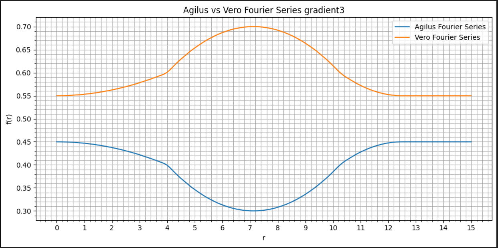

# Fourier Series Generator
This script generates a openVCAD script for a set of bellows that includes a material gradient function for the outter shell of the bellows. When the bellows are streched or compressed stresses are greatest at the edges and at the center. To extend the life span of these bellows you want a larger concentration of soft material at these locations to make them more plyable while haveing a larger concentration of hard material everywhere else to withstand the hoop stresses generated by the working fluid.

To allow us to use a step function in OpenVCAD we need to convert it into a continous function. This is done here by performing a fourier transform. It is not important to understand the math behind this to use this script.

## Examples:

### Example Gradient Function

We take advantage of the radial symetry of the bellow when creating gradients and write the gradient function using the polar choordinate system. Note that since this is a two material gradient that for all *r* the Agilus gradient and Vero gradient sum to *1*.

A [tutorial](../How%20to%20Print%20a%20Bellows%20Stack_DRAFT.pdf) has been writen on how to use this script to create a stack of multimaterial bellows.

## Future Iterations:
- It is a little inconvenient to have to generate a full new python file every time you want to change the gradient. It might be better to write the transformed gradient functions to a .txt file that is then read in an VCAD script.