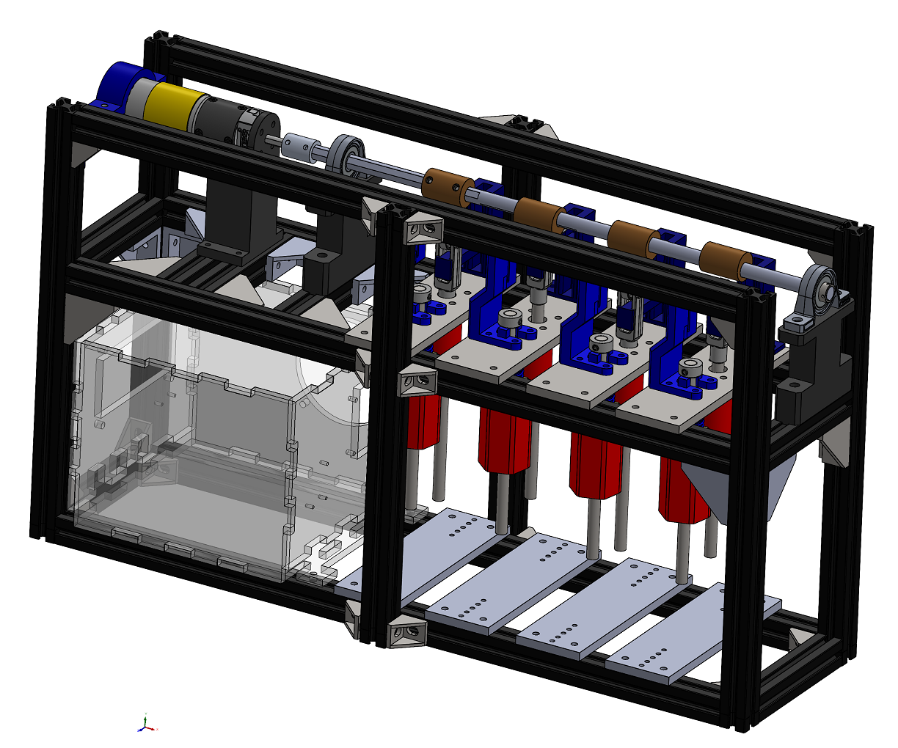
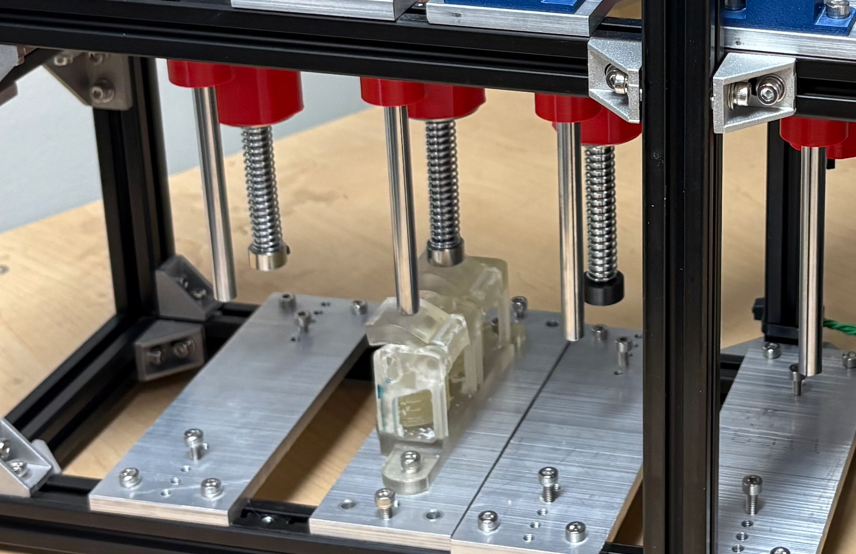

# Test Bench Tutorial
The primary goal of the test bench is to run compression-extensions cycles on sets of bellows until failure to quantify the effectiveness of different bellow designs. The test bench consists of a DC motor connected to a crank shaft with a set of four followers. A set of bellows is loaded in under each follower, and when a follower is pushed downwards by the crankshaft a limit switch connected to the other side of the bellows set is pressed. Once a bellows set is ruptured it will no longer actuate the limit switch and the counter will stop.

### CAD Model:

## 1) Attaching Bellows
Use two M4 bolts to attach a set of bellows to one of the alluminum base plates as shown below.

Then line the bellows up with a set of followers and tighten down the alluminum base plate. The test stand can test up to four sets of bellows at a time.

## 2) Turning on the Cyclic Loader
Turn on the cyclic loader using the green button. After few seconds the motor should start spinning. Verify that the counter switches are being pressed by making sure the correct counters are being ticked on the screen.

## 3) Downloading Data
The data from each trial is stored on the microSD card shown here. Data is saved as a .csv file.

## Trouble Shooting:
